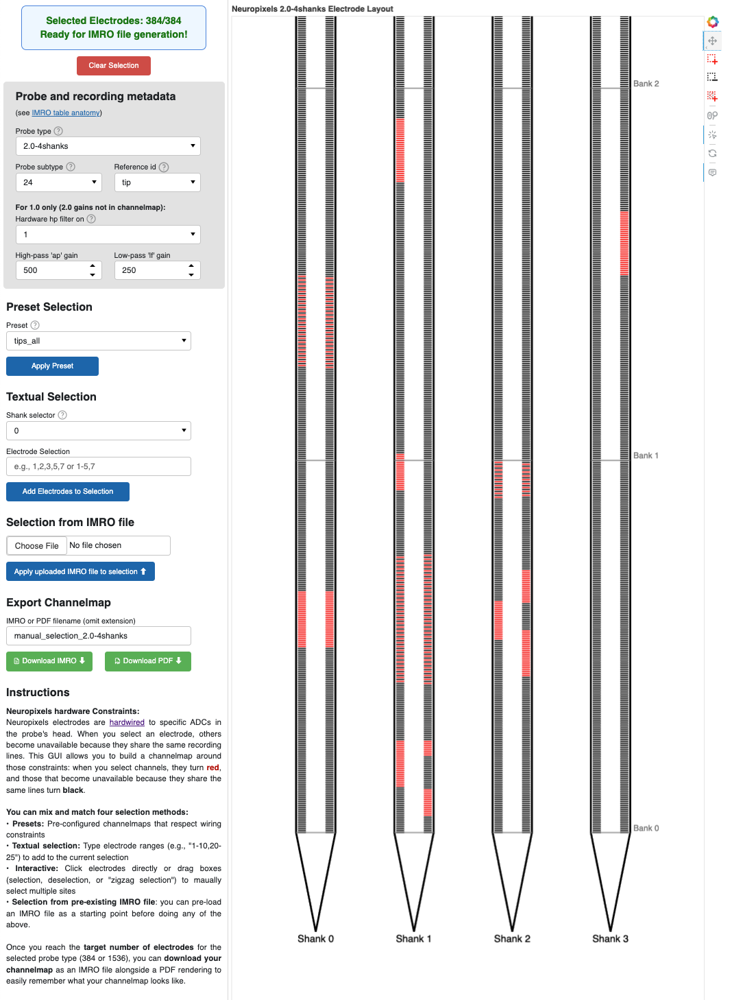

# Channelmap Generator for Neuropixels Probes

⚡ Generate channel maps for Neuropixels probes that respect electrode-ADC wiring constraints! ⚡

<div align="center"> <a href="https://neuropixels-channelmap-generator.pni.princeton.edu">>>> Online GUI <<<</a> </div>


## Installation

Clone the repository and navigate to it:

```bash
git clone http://github.com/m-beau/channelmap_generator.git
cd channelmap_generator
```

### Install the package using pip

For example, in a new conda environment:

```bash
conda create -n my_environment python=3.12
conda activate my_environment
uv pip install . # fast! run pip install uv first.
# or traditionally with pip only:
pip install .
```

### Using `uv` (Recommended)

With `uv`, you can either install dependencies first and then run the application, or run it directly in one command:

Install dependencies, then run:

```bash
uv sync
uv run cmap_gui
```

Or run directly (installs dependencies automatically):

```bash
uv run cmap_gui  # This will automatically install dependencies if needed
```

The second approach is particularly convenient as `uv` will automatically create a virtual environment, install all dependencies from `pyproject.toml`, and run the GUI in a single command.

### Run using Docker (Installation-free)

Run the latest stable Docker image directly without any local installation. The application will be available at http://localhost:5008.

```bash
docker run --rm --name channelmap-app -p 5008:5008 --pull=always ghcr.io/m-beau/channelmap_generator:latest
```

#### Docker Compose

For a more robust deployment, use Docker Compose. See the included `docker-compose.yml` for configuration details:

## Usage

### 1. Browser-based GUI

Launch the interactive GUI from the repository directory using one of these methods:

**If you installed with pip:**

```bash
cmap_gui  # Alias for: python ./channelmap_generator/gui/gui.py
```

**If you're using uv (recommended):**

```bash
uv run cmap_gui  # Automatically manages dependencies and virtual environment
```

Neuropixels electrodes are [hardwired](https://www.neuropixels.org/support) to specific ADCs in the probe's head. When you select an electrode, others become unavailable because they share the same recording lines. This GUI allows you to build a channelmap around those constraints: when you select channels, they turn **red**, and those that become unavailable because they share the same lines turn **black**.

You can mix and match four selection methods:\
• **Presets:** Pre-configured channelmaps that respect wiring constraints\
• **Textual selection:** Type electrode ranges (e.g., "1-10,20-25") to add to the current selection\
• **Interactive:** Click electrodes directly or drag boxes (selection, deselection, or "zigzag selection") to manually select multiple sites\
• **Selection from pre-existing IMRO file:** you can pre-load an IMRO file as a starting point before doing any of the above.

Once you reach the **target number of electrodes** for the selected probe type (384 or 1536), you can **download your channelmap** as an IMRO file alongside a PDF rendering to easily remember what your channelmap looks like.

> [!TIP]
> **Online version**: This GUI is available online at https://neuropixels-channelmap-generator.pni.princeton.edu - you can use it directly in your browser without installing anything.



### 2. Python API / Jupyter Notebook

Check out the code in `generate_channel_maps.ipynb` to reproducibly create custom channel maps. The notebook provides examples for all supported probe types and presets.

Here's a MWE:

```python
import channelmap_generator as cmg

# Generate a channel map
imro_list = cmg.generate_imro_channelmap(
    probe_type="2.0-4shanks",
    layout_preset="tips_all",
    wiring_file="wiring_maps/2.0-4shanks_wiring.csv"
)

# Save to file
cmg.save_to_imro_file(imro_list, "my_channelmap.imro")
```

## Supported Neuropixels versions

- Neuropixels 1.0
- Neuropixels 2.0 1-shank and 4-shank
- Neuropixels NXT (experimental)

UHD currently not supported, reach out if you need it implemented.