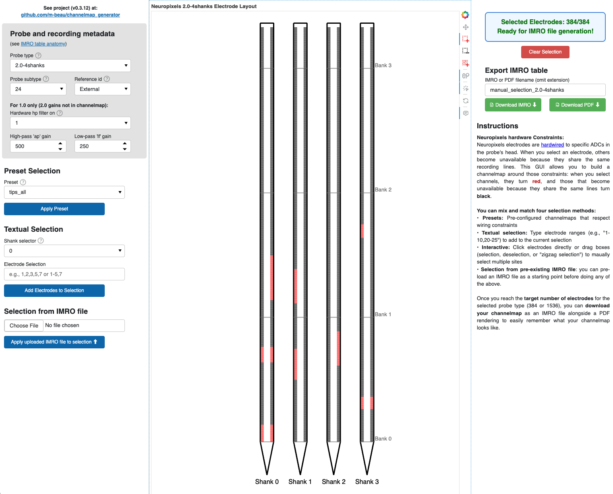

# PixelMap: a browser-based GUI to generate Neuropixels channelmaps

[](https://github.com/m-beau/pixelmap/actions/workflows/tests.yml)
[](https://pixelmap.readthedocs.io)
[](https://www.gnu.org/licenses/gpl-3.0)
[](https://www.python.org/downloads/)

<div align="center">

**Generate IMRO channelmaps for Neuropixels probes that respect electrode-ADC wiring constraints.**

[Online GUI](https://pixelmap.pni.princeton.edu/app) | [Documentation](https://pixelmap.readthedocs.io) | [Paper](#citation)

</div>

## What is PixelMap?

- Browser-based **generation of `.imro` files** for [SpikeGLX](https://billkarsh.github.io/SpikeGLX/help/imroTables/) — the tables that tell SpikeGLX which channels to record from, what reference to use, and recording amplification gain.
- **Arbitrary selection of electrode geometries**, within the boundaries of Neuropixels electrode-ADC hardware wiring constraints.
- Common **presets** available out of the box (reach out to suggest other common geometries!).
- Option to **load a pre-existing `.imro` file** as a starting point (or simply to visualize a probe geometry).

> [!NOTE]
> This tool is in **beta**. The IMRO editor tools in SpikeGLX and Open Ephys work correctly — what we provide here are tools to specify IMRO tables more easily. If you import one of our tables into SpikeGLX or Open Ephys, please double-check that all site selections, referencing, gains, and filter settings are what you intended.



## Installation

```bash
git clone https://github.com/m-beau/pixelmap.git
cd pixelmap
uv run pixelmap  # installs dependencies automatically and launches the GUI
```

Also available via [pip, conda, or Docker](https://pixelmap.readthedocs.io/en/latest/getting-started.html).

## Quick Start

Use the [online GUI](https://pixelmap.pni.princeton.edu/app) directly in your browser — no installation required.

Or launch it locally:

```bash
uv run pixelmap   # or: pixelmap (if installed with pip)
```

1. **Select your probe type** from the dropdown.
2. **Choose a preset** or select electrodes interactively (click, drag, or type ranges).
3. **Download the `.imro` file** once you've reached the target electrode count.
4. **Load in SpikeGLX** via the IM-Setup tab.

### Python API

```python
import pixelmap as cmg

imro_list = cmg.generate_imro_channelmap(
    probe_type="2.0-4shanks",
    layout_preset="tips_all",
    wiring_file="wiring_maps/2.0-4shanks_wiring.csv"
)
cmg.save_to_imro_file(imro_list, "my_channelmap.imro")
```

See the [full documentation](https://pixelmap.readthedocs.io) for the complete API reference, GUI guide, preset reference, and troubleshooting.

## Supported Probes

| Probe type     | Status |
|---------------|--------|
| 1.0           | Supported |
| 2.0, 1-shank  | Supported |
| 2.0, 4-shanks | Supported |
| Quadbase      | Planned |
| NXT           | Planned |

UHD and Opto are not currently on our roadmap — [open an issue](https://github.com/m-beau/pixelmap/issues) if you need support for these.

## Contributing

Bug reports and feature requests are welcome via [GitHub Issues](https://github.com/m-beau/pixelmap/issues). Pull requests are also welcome — please open an issue first to discuss significant changes.

## Citation

A paper describing PixelMap is being prepared for submission to the Journal of Open Source Software (JOSS). A DOI and citation will be provided here once published.

## License

This project is licensed under the [GNU General Public License v3.0](LICENSE.txt).
